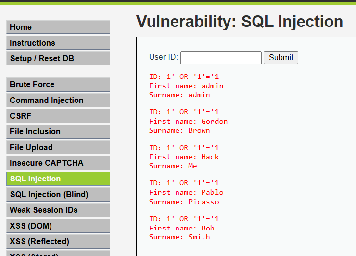

# SQL Injection

## 1. Evidencia

**Módulo DVWA:** SQL Injection  
**Nivel de seguridad:** Low  
**Payload utilizado:** `' OR '1'='1`  
**Captura:**



**Descripción:** Al ingresar el payload `' OR '1'='1` en el campo User ID, la aplicación retornó todos los registros de usuarios de la base de datos sin requerir credenciales válidas. Se obtuvieron los datos de los usuarios: admin, Gordon Brown, Hack Me, Pablo Picasso y Bob Smith.

---

## 2. ¿Por qué ocurre?

La vulnerabilidad existe porque la aplicación construye la consulta SQL concatenando directamente el input del usuario sin ningún tipo de sanitización ni uso de consultas preparadas. La consulta resultante sería equivalente a:

```sql
SELECT * FROM users WHERE user_id = '' OR '1'='1';
```

La condición `'1'='1'` siempre es verdadera, por lo que la base de datos retorna todos los registros. Esto permite a un atacante manipular la lógica de la consulta, eludir autenticación y extraer información confidencial.

---

## 3. CVSS v3.1

**Vector:** `AV:N/AC:L/PR:N/UI:N/S:U/C:H/I:H/A:H`  
**Puntaje Base:** 9.8 — **Crítico**

| Métrica                        | Valor                  |
|--------------------------------|------------------------|
| Vector de Ataque               | Red (Network)          |
| Complejidad del Ataque         | Baja (Low)             |
| Privilegios Requeridos         | Ninguno (None)         |
| Interacción del Usuario        | Ninguna (None)         |
| Alcance                        | Sin cambio (Unchanged) |
| Confidencialidad               | Alto (High)            |
| Integridad                     | Alto (High)            |
| Disponibilidad                 | Alto (High)            |

---

## 4. Defensa

- **Consultas preparadas (Prepared Statements):** Separar el código SQL del dato ingresado por el usuario, eliminando la posibilidad de alterar la lógica de la consulta.
- **ORM (Object Relational Mapping):** Utilizar frameworks que abstraigan el acceso a la base de datos evitando SQL crudo.
- **Validación y sanitización de inputs:** Rechazar o escapar caracteres especiales como comillas simples, punto y coma y guiones dobles.
- **Principio de mínimo privilegio:** El usuario de base de datos utilizado por la aplicación debe tener solo los permisos estrictamente necesarios (solo lectura si aplica).
- **WAF (Web Application Firewall):** Implementar un firewall de aplicación web que detecte y bloquee patrones de inyección SQL conocidos.